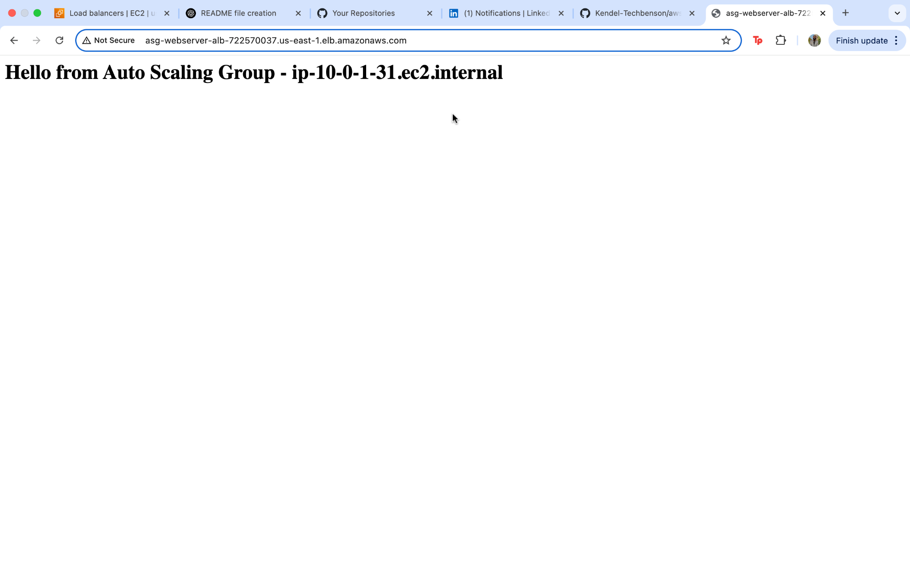

# AWS EC2 Auto Scaling Group with Load Balancer Lab

This lab demonstrates the creation and configuration of an Auto Scaling Group behind an Application Load Balancer using AWS EC2.

## What I Did

- Created a Launch Template with a key pair and AMI
- Configured an Auto Scaling Group with a minimum and maximum instance count
- Created a Target Group and attached it to the Load Balancer
- Verified health checks and instance registration
- Accessed the web server via the Load Balancer DNS

## Skills Demonstrated

- EC2 Launch Template setup
- Auto Scaling configuration
- Load Balancer and Target Group integration
- Health checks and troubleshooting
- Basic Linux web server provisioning with `user-data` script
- End-to-end AWS VPC and EC2 networking setup

## Screenshots

The following screenshots document each step:

- **Launch template created for the Auto Scaling Group.**

  

- **Target group configured for routing traffic to EC2 instances.**

  

- **Application Load Balancer (ALB) successfully created and configured.**

  

- **Auto Scaling Group (ASG) created and linked to the launch template.**

  

- **ASG instances registered and showing healthy in the target group.**

  

- **Web server response verified through the ALB DNS endpoint.**

  

